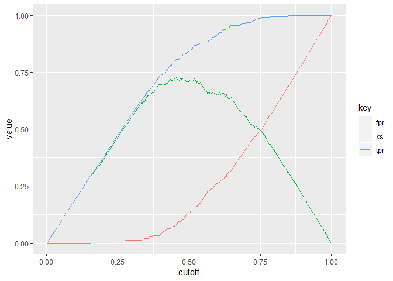

<!-- README.md is generated from README.Rmd. Please edit that file -->

# rawKS

<!-- badges: start -->

<!-- badges: end -->

The goal of rawKS is to easily extract the raw KS statistics to plot and
report. The Python version [pyks](https://github.com/JiaxiangBU/pyks) is
hosted from GitHub.

## Installation

The development version from [GitHub](https://github.com/) with:

``` r
# install.packages("devtools")
devtools::install_github("JiaxiangBU/rawKS")
```

## Example

``` r
library(tidyverse)
#> Registered S3 methods overwritten by 'ggplot2':
#>   method         from 
#>   [.quosures     rlang
#>   c.quosures     rlang
#>   print.quosures rlang
#> ── Attaching packages ───────────────────────────────────────────────────────── tidyverse 1.2.1 ──
#> <U+2713> ggplot2 3.1.1     <U+2713> purrr   0.3.3
#> <U+2713> tibble  2.1.3     <U+2713> dplyr   0.8.3
#> <U+2713> tidyr   0.8.3     <U+2713> stringr 1.4.0
#> <U+2713> readr   1.3.1     <U+2713> forcats 0.4.0
#> Warning: package 'purrr' was built under R version 3.6.1
#> Warning: package 'dplyr' was built under R version 3.6.1
#> ── Conflicts ──────────────────────────────────────────────────────────── tidyverse_conflicts() ──
#> x dplyr::filter() masks stats::filter()
#> x dplyr::lag()    masks stats::lag()
library(rawKS)
data("two_class_example_edited")
max(ks_table(two_class_example_edited$yhat, two_class_example_edited$y)$ks)
#> [1] 0.7276892
ks_table(two_class_example_edited$yhat, two_class_example_edited$y) %>% 
  ks_plot()
```


